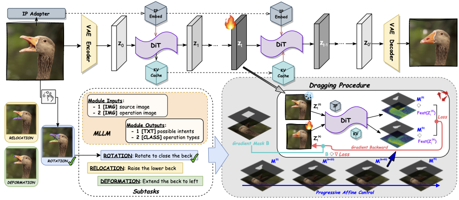

<div align="center">
<h1> [ICLR 2026] DragFlow: Unleashing DiT Priors with Region-Based Supervision for Drag Editing </h1>


Zihan Zhou<sup>1,\*</sup>, 
Shilin Lu<sup>1,\*</sup>,
Shuli Leng<sup>1</sup>,
Shaocong Zhang<sup>1</sup>,
Zhuming Lian<sup>2</sup>,
Xinlei Yu<sup>2</sup>,
Adams Wai-Kin Kong<sup>1</sup> 

<sup>1</sup>Nanyang Technological University, 
<sup>2</sup>National University of Singapore

<sup>*</sup>Equal Contribution


 &nbsp;
 <a href='https://arxiv.org/abs/2510.02253v2'></a> &nbsp;
 <a href='https://github.com/Edennnnnnnnnn/DragFlow'></a> &nbsp;
 <a href='https://huggingface.co/datasets/Edennnnn/ReD_Bench'></a> &nbsp;

</div>


## TL;DR

This repo presents **DragFlow**, the first image drag editor implemented on DiT architecture, which harnesses the strong priors of FLUX for high-quality drag-based editing via a novel region-based paradigm and sets a new SOTA on image drag-editing benchmarks. This repo also provides usage guidance for our proposed dataset, **ReD Bench**.




## Contents
  - [Update Timeline](#-update-timeline)
  - [Preparation Process](#-preparation-process)
    - [1. Repo Clone](#1-repo-clone)
    - [2. Environment Setup](#2-environment-setup)
    - [3. Model Initialization](#3-model-initialization)
    - [4. Dataset Preparation](#4-dataset-preparation)
    - [5. Structure Check](#5-structure-check)
  - [Quick Start](#-quick-start)
    - [a. Demo](#a-demo)
    - [b. Benchmarking](#b-benchmarking)
    - [c. Interface Usage](#c-interface-usage) *(Coming Soon)*
  - [Evaluation Metrics](#-evaluation-metrics)
  - [Dataset Release](#-dataset-release)
  - [Acknowledgement](#-acknowledgement)
  - [Citation](#-citation)


## 📆 Update Timeline
- [x] **Oct. 2025**  ->  Preprint Uploaded
- [x] **Jan. 2026**  ->  Paper Accepted by **`ICLR 2026`** ✨
- [x] **Feb. 2026**  ->  **`ReD_Bench`** Dataset Uploaded to [HuggingFace](https://huggingface.co/datasets/Edennnnn/ReD_Bench)
- [x] **Feb. 2026**  ->  **`DragFlow`** Framework Full Code Released
- [ ] **Mar. 2026**  ->  Interactive Interface & Data Maker Release
- [ ] **Mar. 2026**  ->  Full Instruction Accomplish

## 🛠 Preparation Process
### 1. Repo Clone 
Run the following command to clone the code to your local machine:
```bash
git clone --recursive https://github.com/Edennnnnnnnnn/DragFlow.git
```

### 2. Environment Setup
Then initialize the environment using `Conda`:
```bash
conda env create -f ./dependencies/dragflow.yaml --yes
conda activate dragflow
```

The submodule dependencies will be cloned automatically with `DragFlow`. Run the following command to install:
```bash
cd ./dependencies/FireFlow
pip install -e ".[all]"
cd ../..
```
- **Notes**: If no submodule folder found, please re-trigger the submodule clone at the repo directory, using
    ```bash
    git submodule update --init --recursive
    ```

### 3. Model Initialization
Then cache the adapter checkpoint using the following command:
```bash
huggingface-cli download --resume-download Tencent/InstantCharacter --local-dir ./dependencies/checkpoints --local-dir-use-symlinks False
```
Other reliant models will be loaded from your local `HuggingFace_Hub` caches or downloaded automatically during the first run. If needed, you can edit the model registered pathways explicitly in `./framework/config.yaml`.

### 4. Dataset Preparation
- *Don't want to cache the entire dataset? Try the [Quick Demo](#a-demo) instead!*

Please download the dataset to the expected location, following the instructions present in [Dataset Release](#-dataset-release).

### 5. Structure Check
Once the preparation steps above are finished, your folder structure should be similar to the following:
```text
DragFlow
├── assets               
│   │── flowchart.png
│   └── intro.png
├── datasets
│   │── demo
│   └── ReD_Bench
├── dependencies
│   │── dragflow.yaml
│   │── FireFlow
│   └── checkpoints
│       └── instantcharacter_ip-adapter.bin
├── framework
│   │── (9 python scripts)
│   │── config.yaml
│   └── adapter
│       └── (4 python scripts)
└── evaluation
    └── (3 python scripts)
```

## 🎯 Quick Start
After finishing the preparation steps and activating the environment, we are ready to move on!
### a. Demo
For a quick demo, you can run any of the following commands, with a demo tag (e.g., `--demo cat`):
```bash
python ./framework/bench_dragflow.py --demo cat
```


- **Notes**: Sample details can be found in `./datasets/demos`. You may want to try **different cases**, using:
    ```bash
    python ./framework/bench_dragflow.py --demo human
    python ./framework/bench_dragflow.py --demo train
    python ./framework/bench_dragflow.py --demo view
    python ./framework/bench_dragflow.py --demo cartoon
    ```

### b. Benchmarking
Activate the environment prepared and bench on `ReD_Bench`. Please make sure that the dataset is located at the expected position, such as `./datasets/ReD_Bench`.
```bash
conda activate dragflow
python ./framework/bench_dragflow.py
```

- **Notes**: The first run may take longer. If the required models are not available locally, they will be cached automatically from `Huggingface`. You could also state your own dataset pathway by applying `--dataset_dir`, and use specific GPUs, such as:
    ```bash
    python ./framework/bench_dragflow.py --dataset_dir <path_to_dataset_directory> --device_0 <device_id> --device_1 <device_id>
    ```

To broaden accessibility and support diverse deployment scenarios, this release is **optimized for consumer-grade GPUs**. By leveraging quantization techniques and activation checkpointing, the project now supports compatible execution on configurations using **dual 24GB NVIDIA GPUs**.

### c. Interface Usage
*(Coming Soon)*


## 📊 Evaluation Metrics
For evaluation purpose, you can run the following command, where `--input_dir` indicate the directory path of the dragged images. Please make sure that the dataset is located at the expected position, such as `./datasets/ReD_Bench`:
```bash
python ./evaluation/evaluation.py --input_dir ./outputs
```
The outcomes will be auto-generated in a **parallel directory** concerning the path of your `input_dir`. 
- For example, if your `input_dir` folder is named `./outputs`, the outcome folder will be named `./outputs__eval`, a CSV file named `eval_scores.csv` will be generated inside, which contains all sample outcomes and the mean scores. 

You can also apply your own dataset path by setting `--dataset_dir`, and use specific GPUs, such as:
```bash
python ./evaluation/evaluation.py --input_dir <path> --dataset_dir <path> --device_0 <device_id> --device_1 <device_id>
```
Please note that variations of ±0.002 for *IF-related Metrics* are considered normal in reproduction, whereas *MD-related Metrics* may exhibit a variation of ±1 due to randomness caused by the nature of the evaluation methods.

## 🤗 Dataset Release
**Regional-based Dragging (ReD) Bench**, consisting of **120 samples** annotated with precise drag instructions at both point and region levels. Each manipulation in the dataset is associated with an intention label, selected from relocation, deformation, or rotation.

For quick usage, you can run the following code to acquire the `ReD_Bench` dataset:
```bash
git lfs install
cd ./datasets
git clone https://huggingface.co/datasets/Edennnnn/ReD_Bench
cd ..
```
Please refer to the [HuggingFace](https://huggingface.co/datasets/Edennnnn/ReD_Bench) page for more details about `ReD_Bench` usage.

## 🫡 Acknowledgement
We would like to express our gratitude to the following contributors whose work our code and benchmark are built upon: [FLUX](https://github.com/black-forest-labs/flux), [Diffusers](https://github.com/huggingface/diffusers), [InstantCharacter](https://github.com/Tencent-Hunyuan/InstantCharacter), and [FireFlow](https://github.com/HolmesShuan/FireFlow-Fast-Inversion-of-Rectified-Flow-for-Image-Semantic-Editing).

## 🔖 Citation
If you find our work useful in your research, please consider citing our work:

```bibtex
@article{zhou2025dragflow,
  title={Dragflow: Unleashing dit priors with region based supervision for drag editing},
  author={Zhou, Zihan and Lu, Shilin and Leng, Shuli and Zhang, Shaocong and Lian, Zhuming and Yu, Xinlei and Kong, Adams Wai-Kin},
  journal={arXiv preprint arXiv:2510.02253},
  year={2025}
}
```